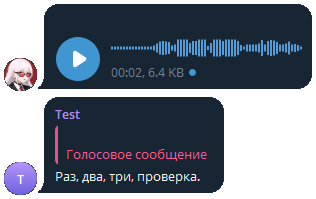

# Telegram Speech-to-Text Bot

Этот Telegram бот преобразует голосовые сообщения в текст с использованием OpenAI API для транскрипции аудио.

## Функциональность

- Конвертирует голосовые сообщения в текст
- Использует OpenAI API для точной транскрипции
- Поддерживает асинхронную обработку сообщений

## Как это работает

1. Пользователь отправляет голосовое сообщение боту.
2. Бот скачивает аудиофайл.
3. Аудио отправляется в OpenAI API для транскрипции.
4. Бот отправляет текстовое содержание голосового сообщения пользователю.

## Примечание

Убедитесь, что у вас есть достаточно прав для использования OpenAI API. Рекомендую использовать [Groq API](https://console.groq.com).
